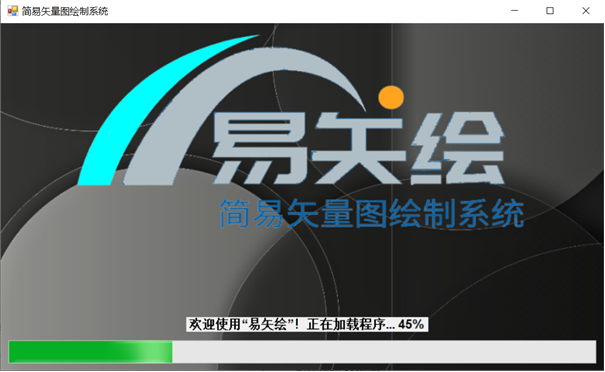
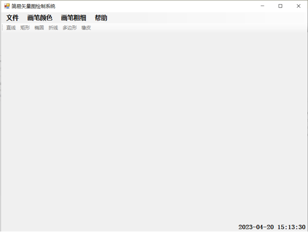
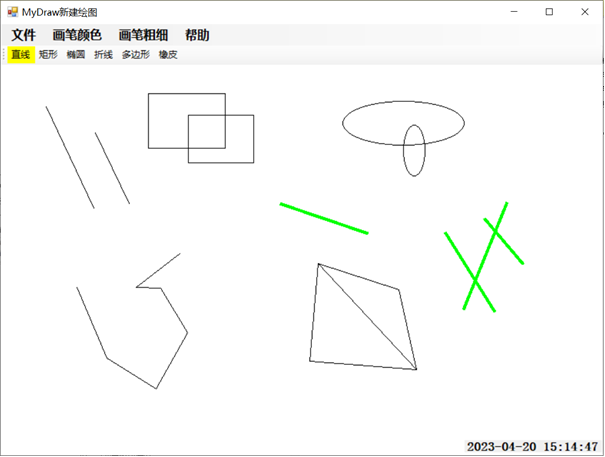

## 项目简介

本项目是一个基于**C#**和**Windows Forms**框架开发的简易矢量图绘制系统。作为华北理工计科Windows应用开发课程大作业，实现了一个功能完备的桌面画板应用，涵盖了从用户会话管理、文件操作到图形绘制的完整流程。

应用启动时会展示加载动画，并设有独立的用户登录与注册系统。用户登录后，即可新建画布或打开已有图片，使用丰富的绘图工具进行创作，并可将作品保存至本地。

如果对您**有帮助**，欢迎**star**⭐或**fork**。

## 核心功能

**1.会话管理**

- 闪屏动画: 程序启动时显示欢迎界面及加载进度条。



- 用户系统: 支持用户**注册**与**登录**，用户信息通过本地文件持久化存储。


**2.文件操作**

- 新建画布: 创建一块空白的白色画布以供绘制。
- 打开文件: 支持打开本地的 `bmp`, `wmf`, `ico`, `cur`, `jpg` 等多种格式的图片文件。
- 保存文件: 可将当前画布内容以图元或图片格式 (`.bmp`) 保存到电脑中。



**3.绘图工具**

- 基础图形: 支持绘制**直线**、**矩形**、**椭圆**。
- 高级图形: 支持绘制**折线**和不规则**多边形**。
- 画笔设置: 可自定义画笔的**颜色**与**粗细**。



**4.用户体验**

- 实时时钟: 主界面右下角实时显示当前系统时间。
-  帮助文档: 内置帮助菜单，点击可跳转至在线帮助页面。
- 状态管理: 在新建或打开文件前，工具栏处于禁用状态，确保了规范的操作流程。 


## 如何运行

#### 一：直接运行 (推荐)

1. 前往本仓库的 **Releases** 页面。
2. 下载最新的 `EasyVectorDraw.zip` 压缩包。
3. 解压后，直接运行 `.exe` 或 `.msi` 文件即可。

#### 二：从源码编译

1. 确保你已安装 Visual Studio 和 .NET Framework (建议 4.7.2 或更高版本)。
2. 克隆或下载本仓库源码。
3. 使用 Visual Studio 打开 `.sln` 解决方案文件。
4. 点击 "生成 (Build)" -> "生成解决方案 (Build Solution)"。
5. 生成成功后，直接按 `F5` 或点击 "启动" 按钮运行。

## 项目结构

```
.
├── VectorDrawingSystem/      # 源代码文件
├── screenshots/       # 项目截图和gif
├── doc/               # 项目文档
├── .gitignore            # Git忽略配置文件
├── LICENSE             # 开源协议
└── README.md             # 项目说明文件
```
